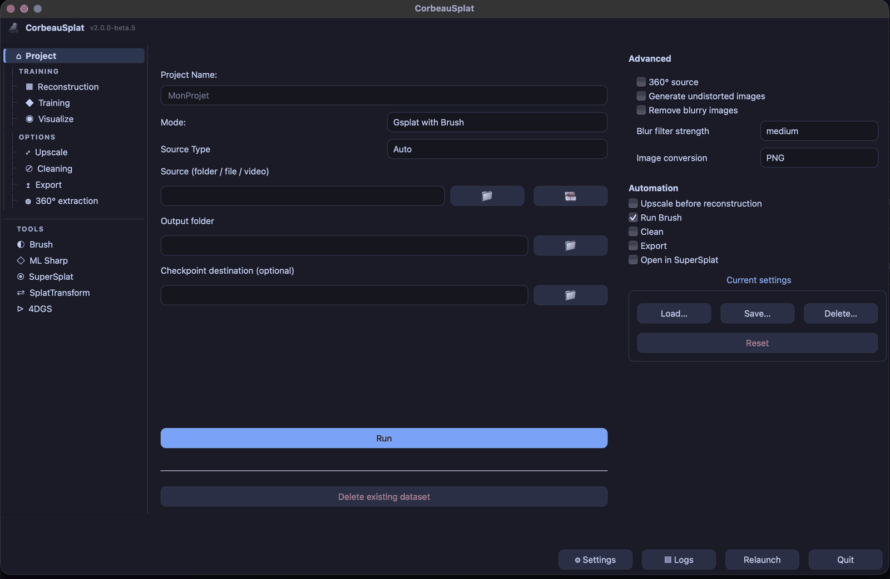

# CorbeauSplat

## 📦 Versions & Branches

| Version | Branch | Status | Release |
|---------|--------|--------|---------|
| **v1.5.1** | `main` | ✅ Stable | [v1.5.1](https://github.com/freddewitt/CorbeauSplat/releases/tag/v1.5.1) |
| **v2.0.0-rc1** | `beta` | 🧪 Release Candidate | [v2.0.0-rc1](https://github.com/freddewitt/CorbeauSplat/releases/tag/v2.0.0-rc1) |

**v2.0.0-rc1** is the first release candidate: no new code over beta.5, the feature set is frozen, and the README now documents everything added since v1.5.1 (one-click pipeline, video range selection, image conversion, Upscale model gallery, named configurations). **v2.0.0-beta.5** completes the eight-lot remediation plan from the 2026-09-15 audit. Security: `ml-sharp`, `nerfstudio` and `360Extractor` were cloned, compiled and executed off an unpinned default branch — all three are pinned now; Upscayl model downloads are verified fail-closed against a pinned catalogue (two of six models previously installed unverified). New: pick an in/out range on a single video before extraction (ffmpeg preview, typed timecodes), choose the image conversion format in the Source panel, `pipeline` continues into Cleaning and Export (`--clean`, `--export`), and missing dependencies are reported at GUI startup. Fixes: `is_safe_path()` promised a containment check it never performed and three security tests could not fail; Sharp could launch with the wrong Python; Brush could start with a flag it rejects; CLI and GUI put checkpoints in different places; upscaling at x1/x2 produced a nonexistent model name; reloading a configuration could start a network download. The Training tab's local Launch button, added in beta.4, is removed — it had to infer paths that tab does not have. 739 tests (from 471), coverage 45%. v2.0.0-beta.4 fixed a third-party dependency audit round, a Reconstruction panel bug where the "Run Brush" checkbox was ignored, a Brush archiving bug that could move an unrelated folder tree, a 4DGS COLMAP bug running SfM on every frame, and a launcher bug on fresh venvs. v2.0.0-beta.3 adds 4DGS: optional pre-COLMAP upscaling of extracted camera frames (shared Upscale engine), the old dedicated "COLMAP only" button merged into a single Launch checkbox, a fix for macOS AppleDouble (`._*`) files wrongly fed to ffmpeg as videos, and a dedicated installer for its own venv. The rail's PARAMÈTRES group is split into ENTRAÎNEMENT/OPTIONS, and the redundant OUTILS "360 Extractor" entry was removed. v2.0.0-beta.2 adds Upscale engine fixes: SIGBUS GPU crash on Apple Silicon, PNG format normalization, input file protection (no overwrites), and QThread re-entrancy safety. v2.0.0-beta.1 features complete UI refonte: reorganized rail (3 tiers), TopBar removed, Settings in panels, PySide6 migration, i18n (283 keys, 9 languages).

⚠️ **Release candidate**: feature-complete, awaiting real-world validation before 2.0.0. For production use, stay on `main` (v1.5.1).

---

**CorbeauSplat** is an all-in-one Gaussian Splatting automation tool designed specifically for **macOS Silicon**. It streamlines the entire workflow from raw video/images to a fully trained and viewable 3D scene (Gaussian Splat).

<div align="center">

[](https://www.buymeacoffee.com/freddewitt)

</div>



## 🚀 What it does

This application provides a unified Graphical User Interface (GUI) to orchestrate the following steps:
1.  **Project Management**: Automatically organizes your outputs into structured project folders with images, sparse data, and checkpoints. Settings can be saved as **named configurations** (load / save / delete) and reused from one project to the next.
2.  **Source Preparation**: Point the app at a video or a folder of images — the type is detected automatically (mixed folders are flagged). For a single video, **pick an in/out range** with an ffmpeg-based preview before extraction. Formats COLMAP cannot read (HEIC, TIFF, BMP, WebP…) are converted to PNG or JPEG for you, or left untouched if you prefer.
3.  **Sparse Reconstruction**: Automates **COLMAP** feature extraction, matching, and mapping. Supports **Glomap** as a modern alternative mapper.
4.  **Undistortion**: Automatically undistorts images for optimal training quality.
5.  **AI Upscaling**: Optionally enhances input images before reconstruction using **upscayl-ncnn** — a fast NCNN-based upscaler with 6 curated models (Real-ESRGAN x4+, 4xLSDIR, 4xNomos8kSC, and more), browsable in a **model gallery** where each one can be downloaded or deleted. Downloads are verified against pinned checksums.
6.  **Training**: Integrates **Brush** to train Gaussian Splats directly on your Mac, with a coarse progress indicator based on the checkpoints written to disk. Choose where checkpoints go, and optionally keep only the latest.
7.  **Cleaning**: Standalone **Nettoyage** tab to remove artifacts from any `.ply` file — transparent splats, oversized splats, spatial outliers — in single-file or batch mode. Three presets: Light / Medium / Strong.
8.  **Format Conversion**: **SplatTransform** tab powered by [PlayCanvas `@playcanvas/splat-transform`](https://github.com/playcanvas/splat-transform) v2.7.1. Converts between PLY, SPZ, GLB, and CSV. Supports SH band reduction, point count decimation, NaN filtering, isolated-splat ("floaters") removal, and Morton spatial reordering.
9.  **Visualization**: Includes a built-in tab running **SuperSplat** for immediate local viewing and editing of your PLY files. The viewer only listens on `127.0.0.1`.
10. **ML Sharp (Image/Video to 3D)**: Uses **Apple ML Sharp** to generate a 3D model from a single image or a sequence of 3D models directly from a video.
11. **4DGS Preparation (Experimental)**: Prepares 4D Gaussian Splatting datasets (multi-camera video → Nerfstudio format), with optional pre-COLMAP upscaling and COLMAP tuning (camera model, matcher, sequential overlap). No Apple Silicon 4D trainer exists, so the module stops at dataset preparation.
12. **360 Extractor (Experimental)**: Converts equirectangular 360° videos into optimal planar image sets (Cube Map, Ring, etc.) for photogrammetry, with AI operator masking.

### 🔗 One-click pipeline

Since v2.0, the steps are no longer separate islands: a single **Launch** button in the Project panel runs the whole chain, driven by the **mode selector** (Gsplat → COLMAP, Sharp → ML Sharp, 4DGS → dataset preparation). Optional steps are ticked in the *Automation* block and each one feeds the next:

**360 extraction → Upscale → Reconstruction → Brush → Cleaning → Export → Viewer**

Every step is reported in the left rail (running / done / error), can be cancelled from the activity bar, and a failed step offers a **"Voir le journal"** button. The same chain is available from the CLI: `pipeline --clean [light|medium|strong] --export FORMAT`, with `--trim_start` / `--trim_end` for video ranges and `--convert png|jpeg|off` for image conversion.

It is designed to be "click-and-run", handling dependency checks, process management, and **session persistence** for you.
It also includes built-in full localization support for **French, English, German, Italian, Spanish, Arabic, Russian, Chinese, and Japanese**.

## ✍️ A Note from the Author

> This program was realized through **"vibecoding"** with the help of **Gemini 3 Pro**.
>
> It was originally created to facilitate the technical workflow for a documentary film titled **"Le Corbeau"**. I am not a professional developer; I simply needed to automate a complex process by gathering the tools I use daily: COLMAP, the Brush app, and SuperSplat. 
>
> I share this code in all humility. I didn't originally plan to release it, but I thought that perhaps someone, somewhere on this earth, might find it useful.
>
> As this software was built via "vibecoding" (AI-assisted coding), it is provided "as is" with no guarantees.

## 🛠 Prerequisites & Installation

### Requirements
- **macOS** (Apple Silicon recommended)
- **Python 3.13+** (Recommended for JIT/Performance) or Python 3.11 (Supported)
- **Xcode Command Line Tools** (Required for compiling custom engines like Glomap or Brush)
- **Homebrew** (for installing system dependencies like COLMAP and FFmpeg)
- **Git**

### Installation
1.  Clone this repository:
    ```bash
    git clone https://github.com/freddewitt/CorbeauSplat.git
    cd CorbeauSplat
    ```

2.  Run the launcher:
    ```bash
    ./"CorbeauSplat.command"
    ```
    *The script will automatically detect missing dependencies (Python packages, Brush, SuperSplat, Rust, Node.js, etc.) and attempt to install them for you.*

## 📖 How to Use

The left rail has four groups: **Project** (always visible), **TRAINING**, **OPTIONS** and **TOOLS**. Missing dependencies are reported when the app starts: essential ones (ffmpeg, COLMAP) in a dialog, feature-specific ones in the log.

1.  **Project panel**:
    -   Select your input (video or folder of images) and an output folder, and name the project (files go to `[Output Folder]/[Project Name]`).
    -   Leave the source type on **Auto**, or force Images / Video. For a video, set the FPS, or use **"Sélection vidéo…"** to choose an in/out range.
    -   Choose the **conversion format** (PNG, JPEG, or off) for images COLMAP cannot read.
    -   Pick the **mode** (Gsplat, Sharp, 4DGS), tick the steps to chain in *Automation* (360 extraction, Upscale before reconstruction, Brush, Cleaning, Export, Viewer), then click **Launch**.
    -   Save your settings as a **named configuration** in *Current settings*.
2.  **TRAINING group**:
    -   **Reconstruction**: COLMAP options, LightGlue matchers, **Glomap** as alternative mapper. Has its own Launch button for a standalone run.
    -   **Training (Brush)**: *Auto-Refine* resumes from the latest checkpoint; presets (built-in or your own — user presets can be deleted); *Nettoyer après* / *Exporter ensuite* post-training options.
    -   **Visualize**: load a `.ply` and start the local SuperSplat viewer.
3.  **OPTIONS group**:
    -   **360° extraction**: install the dedicated environment, then extract images from 360° videos (Ring, Cube Map, Fibonacci) with optional AI operator masking.
    -   **Upscale**: `upscayl-bin` is installed automatically. Pick a model in the gallery (download or delete from its card), then set scale (x1–x4), format and tile size.
    -   **Cleaning**: single-file or batch `.ply` cleaning, three presets (Light / Medium / Strong).
    -   **Export**: PLY → SPZ, GLB, OBJ or XYZ.
4.  **TOOLS group** (standalone modules, typed paths, independent of the chain):
    -   **Brush**, **SuperSplat**, **ML Sharp**, **SplatTransform** (PLY ↔ SPZ / GLB / CSV with SH reduction, decimation, NaN and floaters filtering, Morton reordering), **4DGS**.
    -   **4DGS (Experimental)**: check *Activate* to install Nerfstudio, select a folder of synchronized camera videos, optionally upscale before reconstruction, and launch to get a dataset ready for 4D training.
    -   **ML Sharp (Bonus)**: select a single image or a video, then predict the 3D model(s).

### ⌨️ Command Line Interface (CLI)

CorbeauSplat exposes all its features via the command line.

📘 **[See CLI.md for full command line documentation](CLI.md)**

## 👏 Acknowledgments & Credits

This project stands on the shoulders of giants. A huge thank you to the creators of the core technologies used here:

*   **COLMAP**: Structure-from-Motion and Multi-View Stereo. [GitHub](https://github.com/colmap/colmap)
*   **Brush**: An efficient Gaussian Splatting trainer for macOS. [GitHub](https://github.com/ArthurBrussee/brush)
*   **SuperSplat**: An amazing web-based Splat editor by PlayCanvas. [GitHub](https://github.com/playcanvas/supersplat)
*   **360Extractor**: Advanced 360° video extraction tool. [GitHub](https://github.com/nicolasdiolez/360Extractor)
*   **Apple ML Sharp**: Machine Learning tools for Swift. [GitHub](https://github.com/apple/ml-sharp)
*   **Nerfstudio**: The modular NeRF and Splatting framework (used for 4DGS data prep). [GitHub](https://github.com/nerfstudio-project/nerfstudio)
*   **upscayl-ncnn**: High-performance AI image upscaling using NCNN. Powers the Upscale tab. [GitHub](https://github.com/upscayl/upscayl-ncnn)
*   **PlayCanvas splat-transform**: Fast PLY ↔ SPZ ↔ GLB conversion CLI by PlayCanvas (MIT). Powers the SplatTransform tab. [GitHub](https://github.com/playcanvas/splat-transform)
*   **nianticlabs/spz**: Official SPZ encoder/decoder by Niantic Labs (MIT). Powers the SPZ export in ExportEngine. [GitHub](https://github.com/nianticlabs/spz)
*   **Qt for Python (PySide6)**: The official Qt bindings for Python (LGPL). Powers the entire desktop GUI. [Docs](https://doc.qt.io/qtforpython/)

## 📄 License

This project is licensed under the **MIT License** - see the [LICENSE](LICENSE) file for details. This is the most permissive open-source license, allowing you to use, modify, and distribute this software freely.
